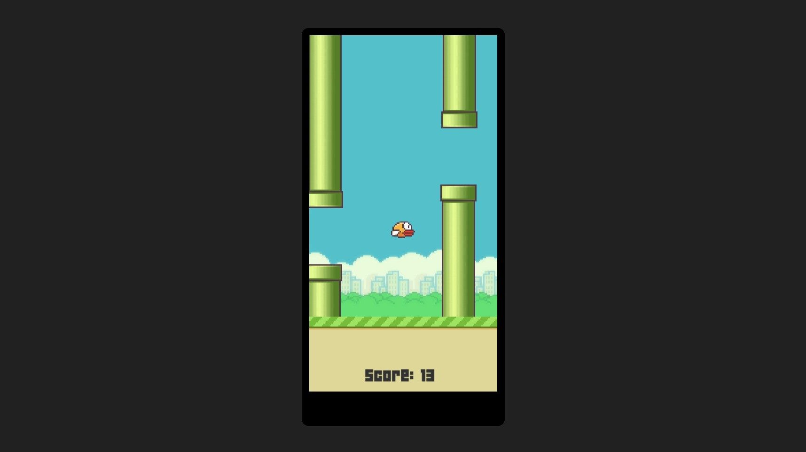

# My Flappy Bird

## Motivation

The Flappy Bird game was part of my adolescence and I wanted to practice my knowledge of Unity, so I created my own version. It is very similar to the original version, simple and fun.

## Technologies

- Unity Engine
- C#
- Javascript
- HTML
- CSS

## Result

I made the game available in a browser version. You access this [game clicking here](https://gabrielgustavoms.github.io/myflappybird/)
